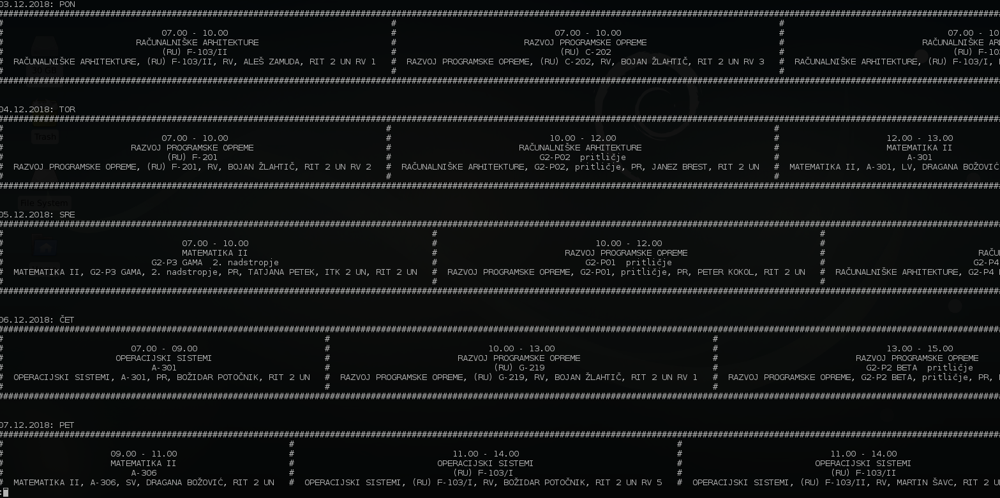
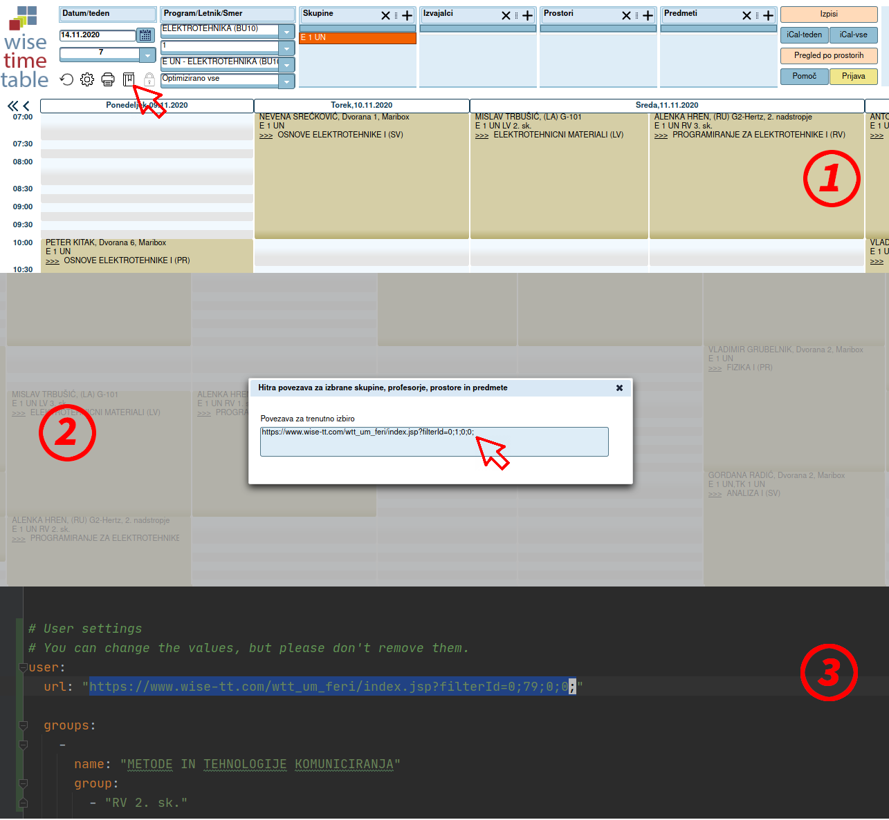
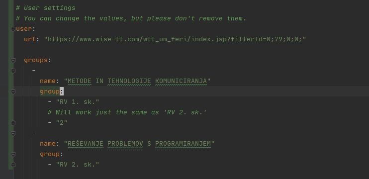

FERI Urnik
============

> **OS Specific:** Linux  
> **Python Version:** 3.x  
> **Testing:** Works on my machine

A commandline utility to display FERIs schedule offline.  
**Urnik** was my answer to FERIs WiseTimetable scheduling web application at the end of 2017.

## How it works ##

Urnik gets its information by downloading an .ics file from the scheduling [website](https://wise-tt.com/wtt_um_feri/). 
Everytime the script is run it reads the .ics file, extracts its events and generates a table for the current days
lectures which is then printed on the terminal.

The program automatically filters subjects based on their groups specified in the configuration file (more on that later).
So it layman's terms, if there is a group in the lab work you're not apart of the program won't show it.

Output of the program:


This picture is displayed by typing the command _urnik -wf | less -S_. The output is piped to _less_ because the
screen is too small and the terminal warps the text.

## Requirements ##

Urnik requires these things to run:
 - [**Firefox**]() - A web browser (used with Selenium for .ics downloading),

## Installation ##

Installing the script is simple:
``` bash
# Install using the python package manager
pip3 install feri-urnik
```

## Usage ##

Just type in the command 
``` bash
urnik -h
```
and you'll see what it can do.

## Configuration ##

The project comes with a configuration file, where you can tell it what schedule to download from the site
and what subject groups the program should allow.
``` bash
# Open the configuration file
urnik -c 
```

#### Link to the schedule ###

The image below shows the [Wise Timetable site](https://www.wise-tt.com/wtt_um_feri/#) and the programs configuration file.
Here are three steps on how to configure the the link to the schedule:
1. Select what you want the table to show (you can even add subjects not present in the Program/Year dropbox).
2. Copy the link displayed after clicking the "_book_" icon shown at step **1)**.
3. Opening the programs configuration file, replace the link in the "_url_" variable with the just copied link.



#### Subjects groups
##### How it works
For every event the program processes it checks if the subjects name matches any of the names set in the configs groups
variable and if it matches, it then checks that the group name is the same as the one set in the subjects group list.


##### How to set it up

Open the configuration file and create a new item in the ___groups___ variable, set the ___name___ to the subjects name and add
your desired groups to the ___group___ variable.

The value of the item in the group variable can be anything, but try to stick to the group name used by Wise timetable.



## Reporting bugs ##
If the application goes south on you, please use GitHubs issue trackers and I'll see what we can do:  
https://github.com/urbikn/feri-urnik/issues

or contact me via email at: urbikn@gmail.com
