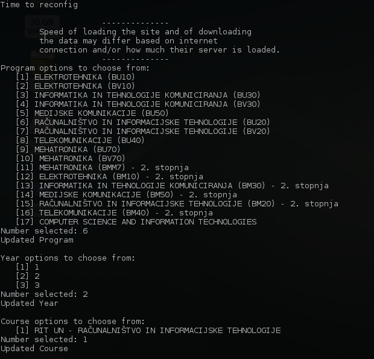
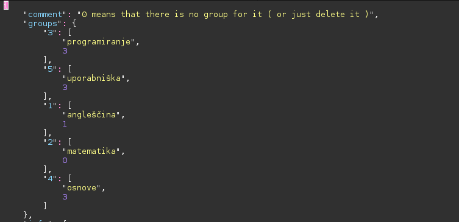

Urnik
============

> **OS Specific:** Linux  
> **Distributions:** Debian/Ubuntu  
> **Python Version:** 3.x  

A commandline utility to display FERIs schedule offline.  
**Urnik** was my answer to FERIs WiseTimetable scheduling web application at the end of 2017.

## How it works ##

Urnik gets its information by downloading an .ics file from the scheduling [website](https://wise-tt.com/wtt_um_feri/). Then it parses the .ics file and writes it into a file named _urnik.txt_ in a table structure (look at the picture).  It also writes a second table that uses filters based on the users configuration ( which classes s/he is/n't attending). In the end there are two tables, one for the entire class and one for the specific users settings.

The program uses the CLI to display its data via less.


this picture is displayed by typing the command _urnik -gw_

## Requirements ##

Urnik requires four things to run:
 - [**Pip3**](https://pip.pypa.io/en/stable/quickstart/) - Python's package manager system,
 - [**Firefox**]() - A web browser (used with Selenium),
 - [**Python's Selenium**](https://selenium-python.readthedocs.io/) - An API with a suite of tools for automating web browser ( **auto installed** )
  - [**geckodriver**](https://github.com/mozilla/geckodriver) - Proxy for using W3C WebDriver compatible clients to interact with Gecko-based browsers ( **auto installed** )

## Installation ##

Download the zip or clone the project and change directory to unziped or cloned folder.
In the folder there is a shell script called **setup**. This script will set up all the needed things to make the program work and you can start it like:
``` bash
bash setup
```
or
``` bash
./setup
```
During the installation you'll be given options for the program, year and course. Chose the one you're currently attending ( you can change it anytime with the command _urnik -r_.
## Usage ##
Just type in the command _urnik -h_ and you'll see what it can do.

### Configuration ###
This was started using the _urnik -r_ command. The entire process starts a browser and gets the data from the dropdown menus ( need the browser because it's a dynamic site ) and then saves it into the configuration file _user_data.json_.   



### Using the filter ###

The way the filter works is by specifying a unique key that represents the courses name ( so the filters know to look for that specific course ) and the group number which you are attending. And that's it.  
And sometimes there are no groups but it's still not a lecture, so either set that course name to 0 or just remove it from the list.




## Reporting bugs ##
If the application goes south on you, please use GitHubs issue trackers and I'll see what we can do:  
https://github.com/urbikn/feri-urnik/issues

or contact me via email at: urban@knuples.net
